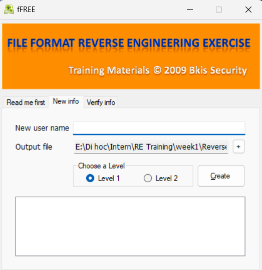
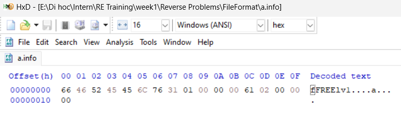
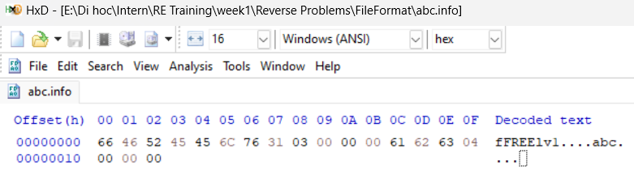
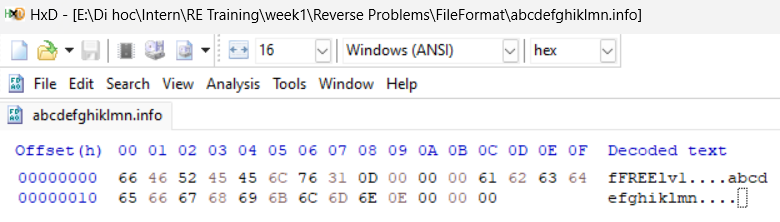
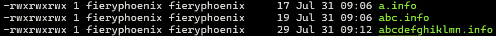
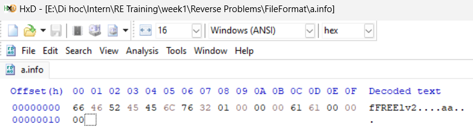
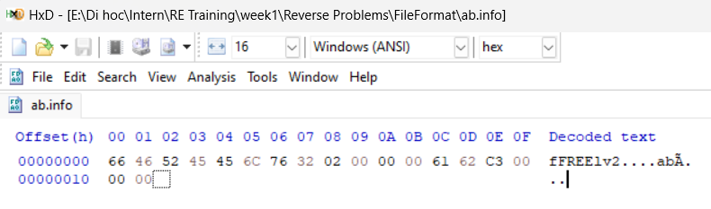
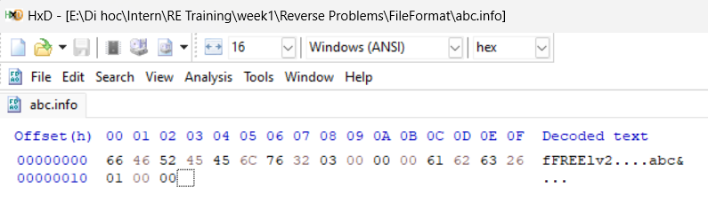

# Write-Up

## Challenge Information
**Name:** File Format

**Category:** Reverse engineering

## Tools Used
- **Tool 1:** ghidra
- **Tool 2:** hex editor

## Approach and Solution

### Level 1: 
The challenge give us an executable file `FFRev.exe: PE32 executable (GUI) Intel 80386 Mono/.Net assembly, for MS Windows`. Furtherlooking into ghidra only give us assembly code with no clear c decompile code.

We try to create different username to further inspect `.info` file:

A pattern emerge, when we input our username, the exe file create a data file with the format `fFREE1v1{Our_Input_UserName}` and we can be ensure by inspecting the number of bytes in the file increase with the number of characters in the input

### Level 2:
The challenge now use the mode level 2, same as level 1, we look further into the hex editor:

We can see that the format is quite the same as in level, but now it add a byte at the end of the username:
Further inspection we notice:
- `a`: a = 0x61 -> last byte is 0x61
- `ab`: a = 0x61, b = 0x62 -> last byte is 0x61 + 0x62 = 0xc3
- `abc`: a = 0x61, b = 0x62, c = 0x63 -> last byte is 0x61 + 0x62 + 0x63 = 0x126 -> 0x26 due to overflow

A pattern emerge, same as level but at the end of the user name it calculates the sum of hex value for each characters in the password.

**Flag:**