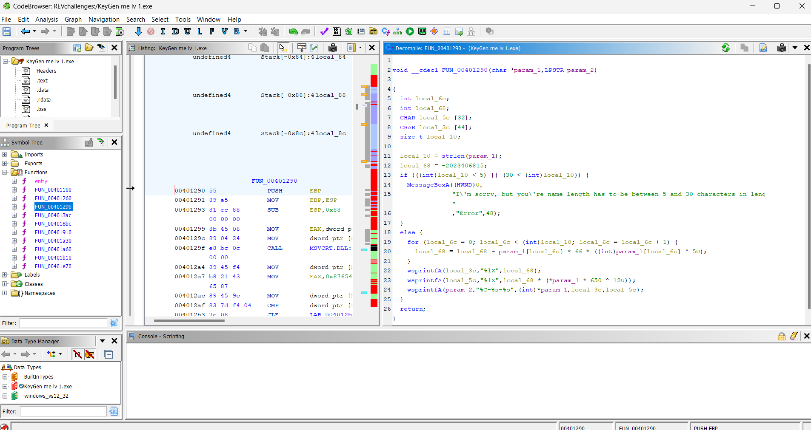
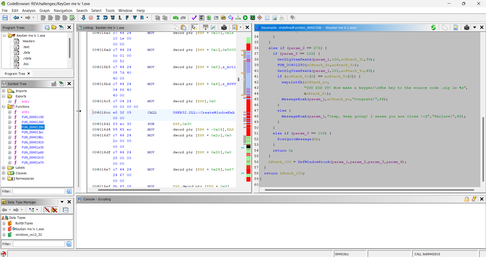
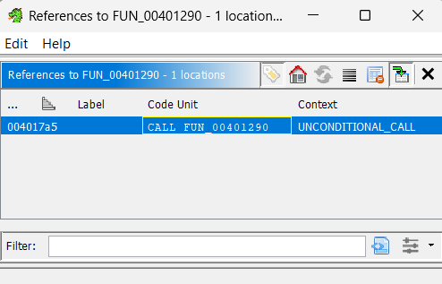
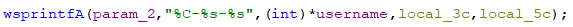
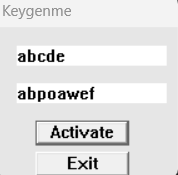
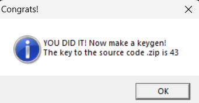

# Write-Up

## Challenge Information
**Name:** Keygen

**Category:** Reverse engineering

## Tools Used
- **Tool 1:** ghidra

## Approach and Solution

### Level 1: 
First we scroll through the functions and find anything interesting:

We have found the function `FUN_00401290(aCStack_3c, acStack_6c)`, with 2 parameters 
- aCStack_3c: Username
- acStack_6c: Unknow

Checking the reference, we are navigated to:

Flow:
1. Activate button is pressed (param_3 = 102)
2. Put retrieved text from edit control (with id = 100, which is the username) to aCStack_3c
3. Called FUN_00401290 that check if the username length is between 5 & 30 characters
4. In the function, it return the first character of the password + 2 strings (currently we dont need to care about these)

5. Put retrieved text from edit control (with id = 101, which is the username) to aCStack_9c
6. It check if the first char of user name and first char of password is the same

With that, we have 2 condition needs to be satisfied:
- Username length in the range of 5 - 30 characters
- The first character of username & password must be the same

Trying the password we get

### Level 2:
