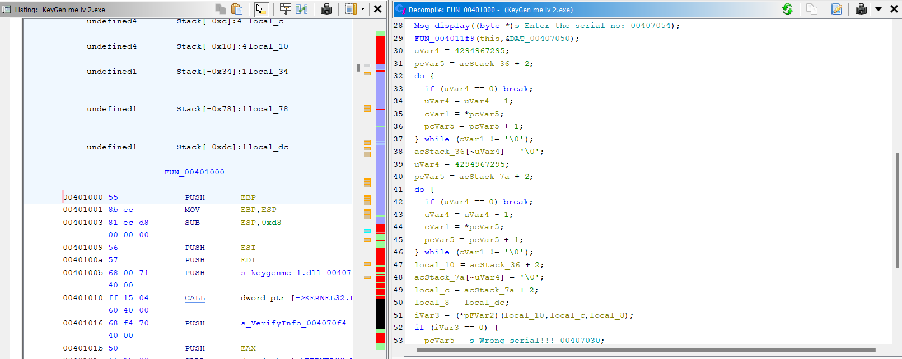

# Write-Up

## Challenge Information
**Name:** Keygen

**Category:** Reverse engineering

## Tools Used
- **Tool 1:** ghidra

## Approach and Solution

### Level 1: 
First we scroll through the functions and find anything interesting:


We have found the function `FUN_00401290(aCStack_3c, acStack_6c)`, with 2 parameters 
- aCStack_3c: Username
- acStack_6c: Unknow

Checking the reference, we are navigated to:


Flow:
1. Activate button is pressed (param_3 = 102)
2. Put retrieved text from edit control (with id = 100, which is the username) to aCStack_3c
3. Called FUN_00401290 that check if the username length is between 5 & 30 characters
4. In the function, it return the first character of the password + 2 strings (currently we dont need to care about these)

5. Put retrieved text from edit control (with id = 101, which is the username) to aCStack_9c
6. It check if the first char of user name and first char of password is the same

With that, we have 2 condition needs to be satisfied:
- Username length in the range of 5 - 30 characters
- The first character of username & password must be the same

Trying the password we get


### Level 2:
Navigate through `entry` -> `FUN_00401000`, we are greeted with an interesting code:




It contains the code that call `KeyGenMe_1.dll` with the function `VerifyInfo` and if the result is true, then it prints out "Right Serial"

So our task now change to finding `VerifyInfo` in the dll file:


Keep navigating, we are now in a function that check our string whether it is the correct format or not. 

Overview there are something we need to note:
1. `wsprintfA(param_3,"%3.3d-%3.3d-%3.3d-%3.3d",(uint)local_107,(uint)bVar3,(uint)local_105,(uint)local_106);`: This code format our string into the form of XXX-XXX-XXX-XXX
2. `byte bVar3; byte local_107; byte local_106; byte local_105;`: All of the value being format is in byte type, which contain value ranging from 0 - 255
3. Further inspection we notice that `param_1` represent name, `param_2` represent company name.

So with that and conditions in the code, we can write a python script to get the flag:

```
def compute_parts(param1, param2, param3, param4):
    str_len1 = len(param1)
    str_len2 = len(param2)
    if str_len1 >= 33 or str_len2 >= 65 or param4 <= 15:
        return 0

    concat_str = param1 + param2
    str_len = len(concat_str)

    part1 = 0
    part4 = 32
    part2 = 8
    part3 = 39
    ivar3 = 2
    ivar2 = 4

    for i in range(str_len):
        if str_len <= ivar3:
            ivar3 = 0
        if ivar2 < 0:
            ivar2 = str_len - 1

        bvar1 = ord(concat_str[i])
        part1 += bvar1
        part4 += ord(concat_str[ivar3]) * bvar1
        if i + 1 < str_len:
            part2 -= ord(concat_str[i + 1]) * ord(concat_str[ivar2])

        part3 += (ord(concat_str[ivar2]) | bvar1) & ord(concat_str[ivar3])

        ivar3 += 1
        ivar2 -= 1

    # Ensure parts are in the range 0-255
    part1 &= 0xFF
    part2 &= 0xFF
    part3 &= 0xFF
    part4 &= 0xFF

    formatted_string = "{:03d}-{:03d}-{:03d}-{:03d}".format(part1, part2, part3, part4)
    return formatted_string

param1 = "abcdef"
param2 = "abcd"
param3 = None
param4 = 256
result = compute_parts(param1, param2, param3, param4)
print(result)
```

