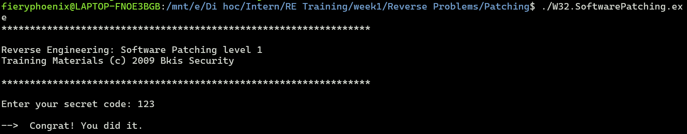
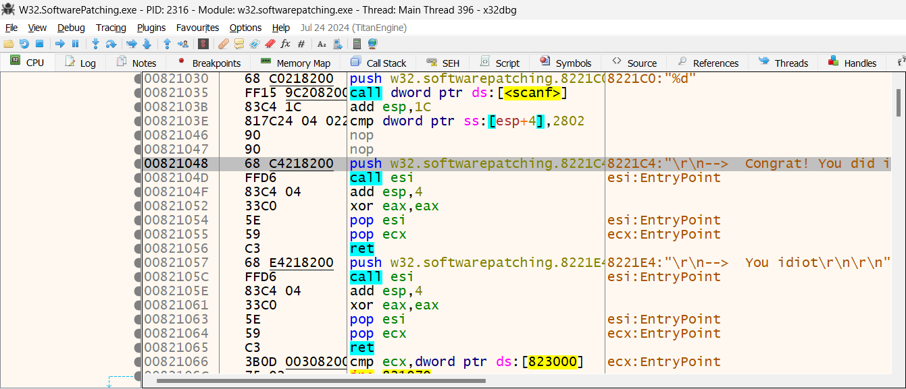

# Write-Up

## Challenge Information
**Name:** W32

**Category:** Reverse engineering

## Tools Used
- **Tool 1:** ghidra

## Approach and Solution

First we running the exe file

The file had been patched to print only correct answer, we need to patch to view only the wrong answer

Base on the output, we search for the reference of `Congrat! You did it.`

Follow it in the dump, we have

we see 2 suspicious `nop`, which is equivalent to a "short" jump operation, which may be the operation to jump to the address printing `You idiot`   

We assemble a new instruction for it

And get the result

